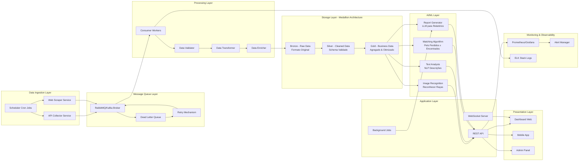

## Diagrama de componentes
Esse diagrama apresenta os componentes do projeto e como eles irão interagir entre si.

Com a possiblidade de escalar o projeto, podemos adicionar mais componentes em cada camada.

