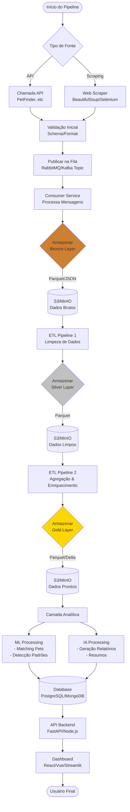

## Diagrama do fluxo de dados
Esse diagrama representa o fluxo de dados do projeto.

Com essa arquitetura, podemos ter uma visão macro do projeto e entender como os dados fluem entre os componentes e como podemos implementar e, no futuro, escalar o projeto.

