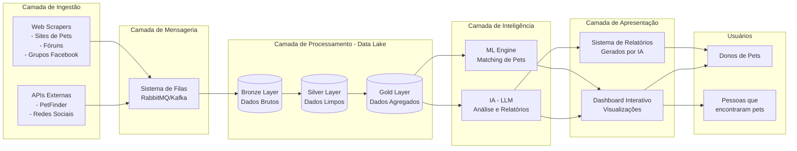

## Arquitetura Geral

Essa arquitetura é uma solução de software que visa resolver o problema de animais perdidos e encontrados.

O foco do projeto é o suporte a busca de animais perdidos e encontrados, com o foco em IA, análise de dados, web scraping e visualização de dados.

