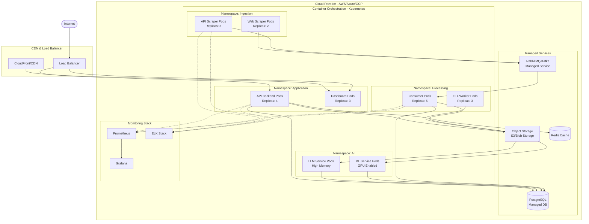

## Diagrama de implementação

Esse diagrama apresenta a implementação da arquitetura em um ambiente de nuvem.

Com a implementação em nuvem, podemos ter uma arquitetura escalável e resiliente.

LEMBRANDO QUE ESSA ARQUITETURA É APENAS UM EXEMPLO, PODENDO SER ADAPTADA PARA OUTRAS NUVENS E ESTÁ SUJEITA A MUDANÇAS.

