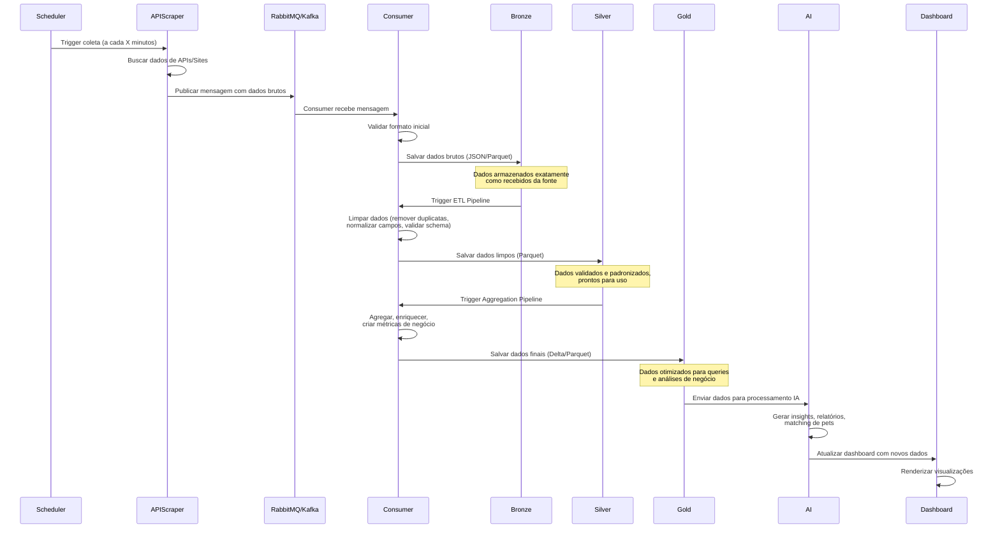

## Diagrama de sequência
Esse diagrama apresenta a sequência de eventos que ocorrem no projeto.

Com a sequencia lógica de eventos, podemos entender melhor o funcionamento do projeto e onde poderão haver quebras na execução.

