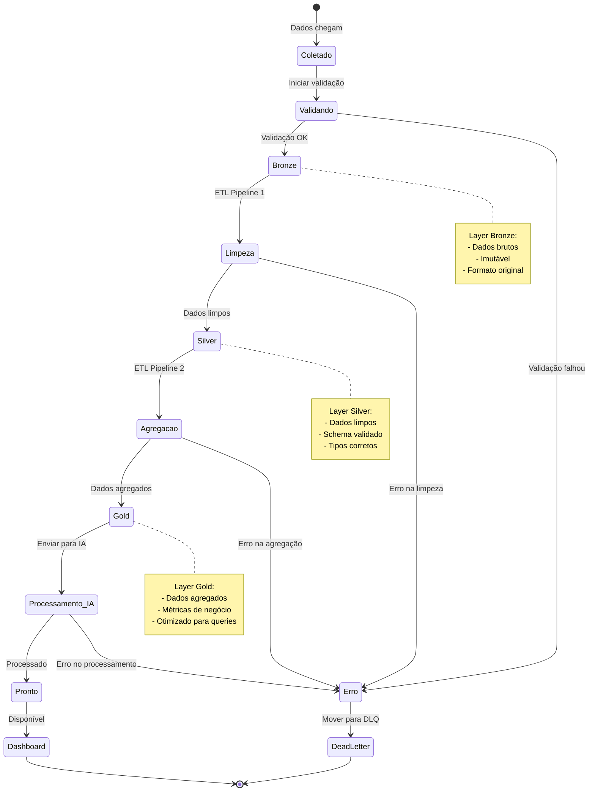

## Diagrama de estado
Esse diagrama apresenta os estados que os dados passam durante o processamento.

Com esse diagrama, podemos entender melhor o ciclo de vida dos dados e como eles são processados em cada etapa.

